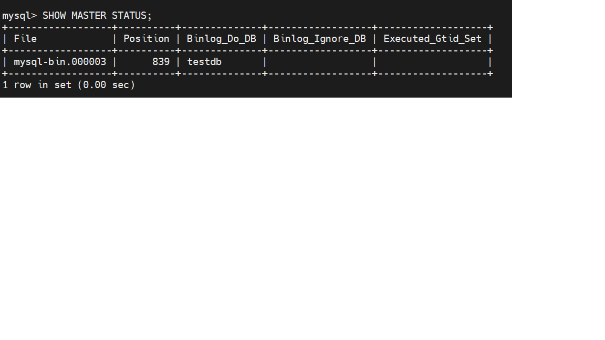
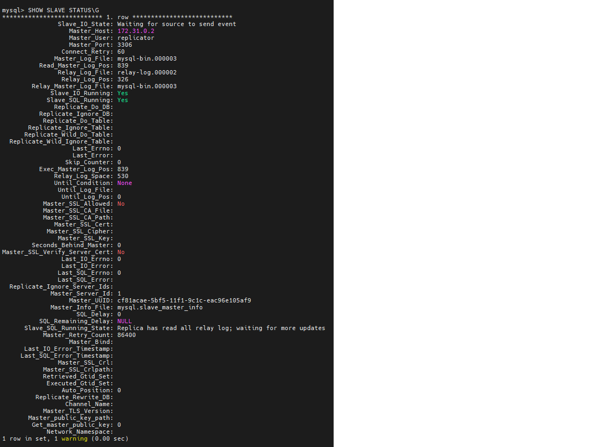
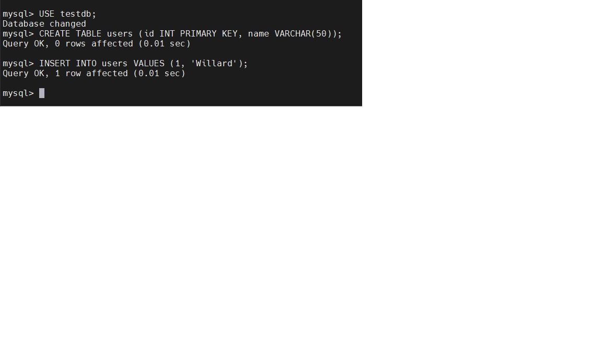
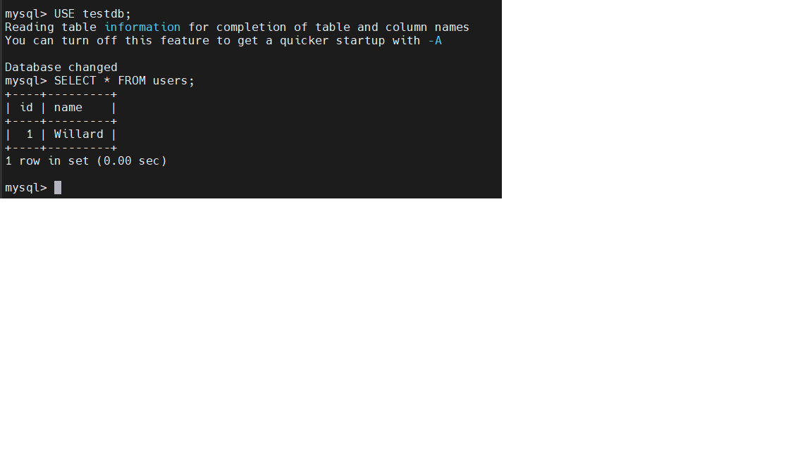
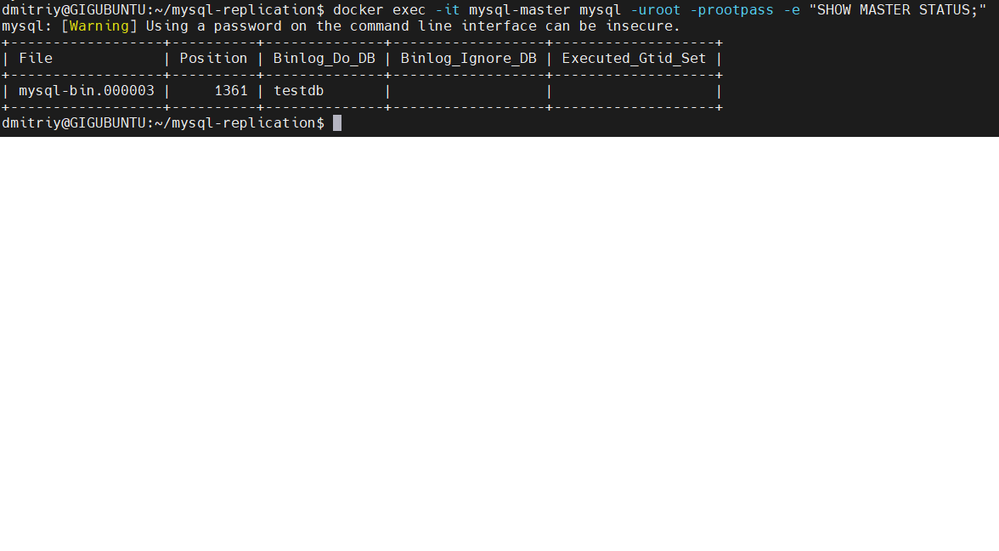
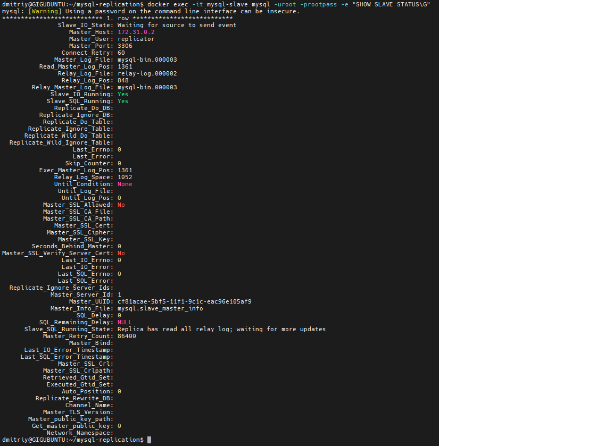

# Репликация и масштабирование. Часть 1

## Задание 1 — Различия режимов репликации

**Master-Slave:**
Один мастер принимает все запросы на запись (INSERT/UPDATE/DELETE), слейв только читает и синхронизируется с мастером через бинлог. Если мастер упал — слейв сам не становится мастером, требуется ручное вмешательство. Используется для масштабирования чтения и создания резервных копий.

**Master-Master:**
Оба сервера принимают запись и одновременно являются слейвами друг для друга. Более сложная настройка, есть риск конфликтов при одновременной записи на оба сервера. Используется для отказоустойчивости и географически распределённых систем.

------------------------------------------------------

## Задание 2 — Конфигурация Master-Slave репликации

Статус мастера: бинлог `mysql-bin.000003`, позиция 839, репликация настроена на базу `testdb`.

Статус слейва: `Slave_IO_Running: Yes`, `Slave_SQL_Running: Yes`, отставание 0 секунд — репликация работает.

На мастере создана таблица `users` и добавлена запись `(1, 'Willard')`.

На слейве выполнен `SELECT * FROM users` — данные реплицировались автоматически.

Финальный статус мастера: позиция обновилась до 1361 после записи данных.

Финальный статус слейва: `Slave_IO_Running: Yes`, `Slave_SQL_Running: Yes`, позиция синхронизирована с мастером (1361).
